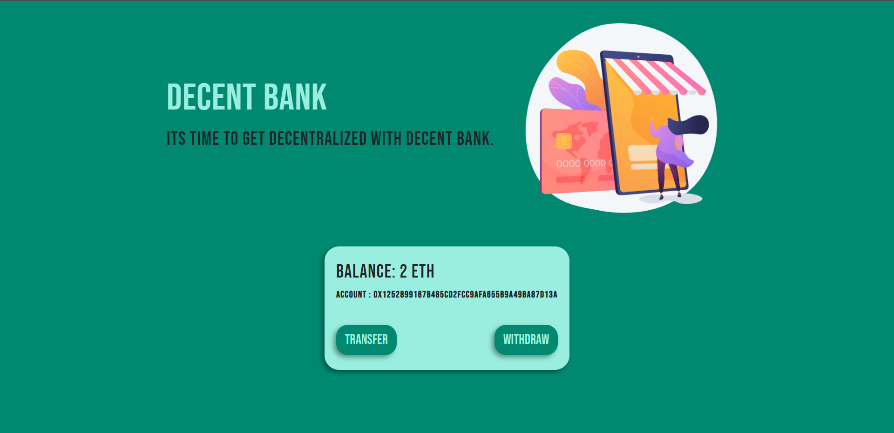

# Decent Bank

## Description
This web application is decentralized. Used WEB.JS ,Truffle,React.JS, with this app u can transfer or withdraw your Ethers. 

- Web3. js is a collection of libraries that allow you to interact with a local or remote ethereum node using HTTP, IPC or WebSocket. 
- Truffle is a development environment, asset pipeline, and testing framework for developing smart contracts.
